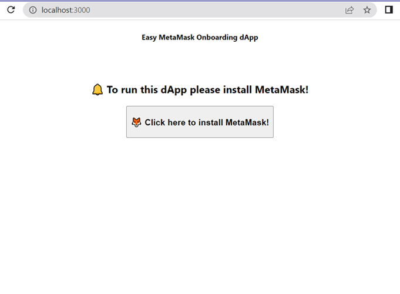
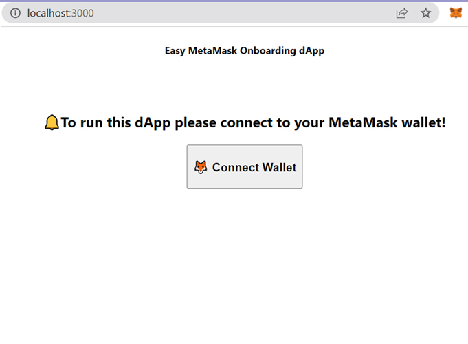
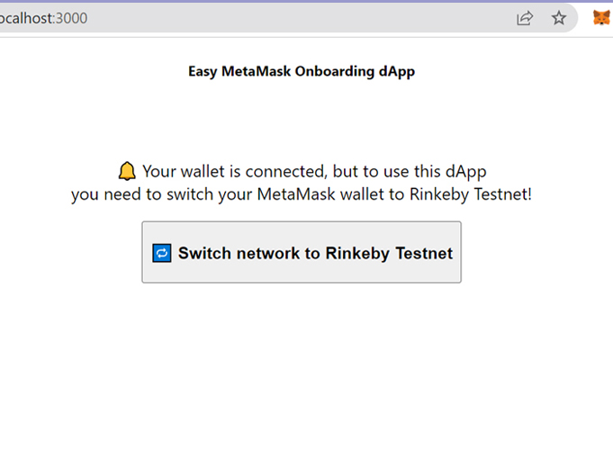
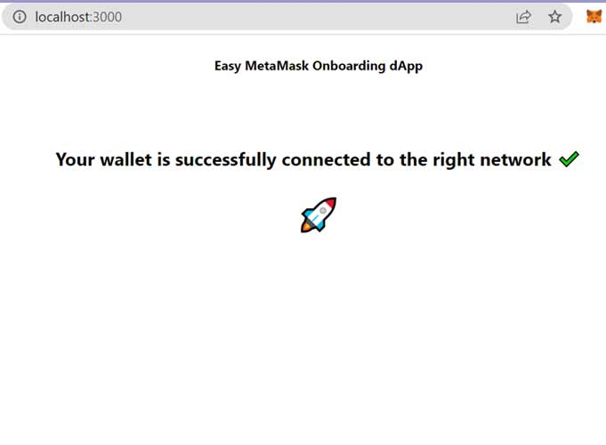

## About Easy MetaMask Onboarding dApp

This react dApp is based on the <a href="https://docs.metamask.io">MetaMask’s Developer documentation</a> and is intended to help developers who want to use MetaMask in their projects with as little friction as possible.

In easy way, we can have 4 different situations:

1. MetaMask browser extension is ***not installed***

2. MetaMask is ***installed, but not connected to the dApp***

3. MetaMask is ***installed and connected, but not on the right network***

4. MetaMask is installed, connected and is also on the right network ✔️

Each of this possible stages are catched and handled intuitively by the user directly in the UI.

## Installation

Clone the repo

   ```sh
   git clone https://github.com/Teodor-Iancu/metamask-easy-onboarding.git
   ```

Change directory to *metamask-easy-onboarding*

   ```sh
   cd metamask-easy-onboarding
   ```

Install packages

   ```sh
   yarn install
   ```

Start local development

   ```sh
   yarn start
   ```

## Screenshots

  **1. MetaMask browser extension is not installed.**

  
  
___

  **2. MetaMask is installed, but not connected to the dApp.**

  

___

  **3. MetaMask is installed and connected, but not on the right network.**
  

___

  **4. MetaMask is installed, connected and is also on the right network.**

  


